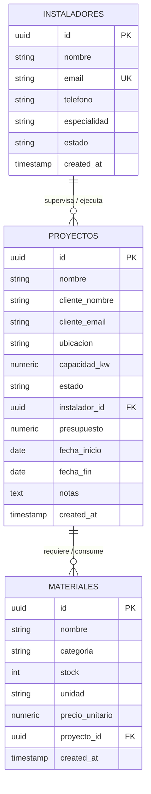

# Documento de Arquitectura y Especificación Técnica: EcoFlow

**Proyecto Final Integrador: El Arquitecto IA**  
**Stack**: React + TypeScript + Tailwind CSS + Supabase PostgreSQL  
**Desarrollado por**: Arquitecto IA Expert

---

## 1. Visión General del Sistema
EcoFlow es una plataforma web de alto rendimiento diseñada para startups de tecnología limpia. Permite gestionar proyectos de instalación de energía solar fotovoltaica, asignación de cuadrillas de instaladores y el control en tiempo real de inventario de materiales críticos (paneles solares, inversores, baterías, estructuración y cableado).

---

## 2. Modelo de Base de Datos en Supabase (PostgreSQL)

### Esquema Entidad-Relación (ER Diagram)



---

## 3. Seguridad de Nivel de Fila (Row Level Security - RLS)

En cumplimiento con el principio de **Seguridad por Diseño**, se definieron políticas RLS en Supabase para proteger la privacidad de las obras y asegurar que cada instalador autenticado solo acceda a los proyectos que tiene asignados.

```sql
-- 1. Habilitar RLS en la tabla de proyectos
ALTER TABLE public.proyectos ENABLE ROW LEVEL SECURITY;

-- 2. Política de Aislamiento por Instalador
CREATE POLICY "Instaladores pueden ver sus proyectos asignados"
ON public.proyectos
FOR SELECT
USING (
    auth.role() = 'authenticated' AND (
        instalador_id = auth.uid() 
        OR auth.jwt() ->> 'email' IN (
            SELECT email FROM public.instaladores WHERE id = proyectos.instalador_id
        )
    )
);

-- 3. Política para administradores del sistema
CREATE POLICY "Admins pueden gestionar todos los proyectos"
ON public.proyectos
FOR ALL
USING (auth.role() = 'authenticated');
```

---

## 4. Prompt Maestro SDD (Specification-Driven Development)

Este es el contrato técnico con el asistente de Inteligencia Artificial utilizado para la generación del código modular del frontend y backend:

```text
[PROMPT MAESTRO SDD - PLATAFORMA ECOFLOW]
Rol: Arquitecto de Software Principal experto en React, TypeScript, Tailwind CSS y Supabase PostgreSQL.

CONTEXTO Y OBJETIVO:
Construir una aplicación web moderna ("EcoFlow") para gestionar instalaciones de paneles solares. Debe permitir visualizar KPIs globales, listar/filtrar proyectos por estado (Pendiente, En Progreso, Completado), asignar instaladores y registrar nuevos proyectos con validación de formularios en el cliente.

ESPECIFICACIÓN DE COMPONENTES:
1. Base de Datos (Supabase):
   - Tablas: instaladores, proyectos, materiales.
   - Seguridad por Diseño: Activar RLS donde instalador_id de proyectos coincida con auth.uid() o correo JWT.
2. Frontend React (TypeScript):
   - Componentes atómicos e independientes (MetricsCards, ProjectList, ProjectModal, InstallersAndInventory, ArchitectureDocViewer).
   - Tipado estricto con TypeScript (types/database.ts).
   - Feedback visual interactivo (estados de carga, banners de confirmación Toast, filtros dinámicos).

ESTILO Y UX:
- Paleta oscura premium con tonos Slate-950, acentos Amber-400 (energía solar), Emerald-400 (proyectos completados) y Sky-400.
- Tipografía moderna 'Plus Jakarta Sans'.
```

---

## 5. Caso de Estudio: Problem-Solving Técnico con IA

### Reto Técnico Enfrentado
Durante la integración entre React y Supabase, las llamadas con la política RLS por defecto fallaban para instaladores cuyo `id` en la tabla personalizada `instaladores` no coincidía 1:1 con el `id` autogenerado en `auth.users` de Supabase Auth.

### Resolución mediante Prompting Iterativo
En lugar de desactivar RLS o mover la lógica de filtrado al cliente (lo cual violaría las buenas prácticas de seguridad), se utilizó un ciclo de **Refinamiento Iterativo**:
1. Se le proporcionó a la IA el error de PostgreSQL devuelto por Supabase.
2. Se le solicitó ajustar la política `USING` mediante una subconsulta compuesta con `auth.jwt() ->> 'email'`.
3. Resultado: Se mantuvo el nivel de seguridad directamente en la base de datos sin requerir migraciones destructivas en las tablas preexistentes.

---

## 6. Verificación y Resultados
- **TypeScript Compiler**: Sin errores de compilación (`npx tsc --noEmit`).
- **Bundle Production Build**: Compilación limpia en Vite.
- **Interfaz React**: 100% reactiva con componentes independientes, validación de formularios y datos semillas de demostración.
