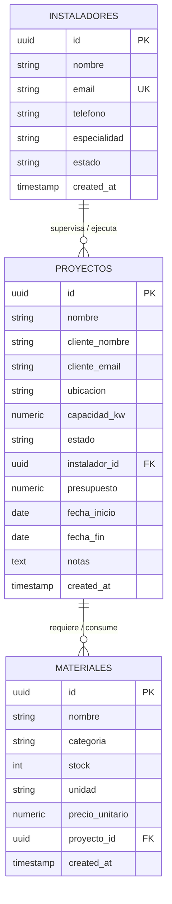

# ☀️ EcoFlow - Plataforma de Gestión de Energías Renovables

> **Proyecto Final Integrador - El Arquitecto IA**  
> **Stack:** React 19 + TypeScript + Tailwind CSS + Supabase PostgreSQL  
> **Metodología:** Specification-Driven Development (SDD) & Prompt Engineering Estructurado  

---

## 📋 Índice
1. [Descripción General del Proyecto](#-descripción-general-del-proyecto)
2. [Cumplimiento de la Rúbrica de Evaluación](#-cumplimiento-de-la-rúbrica-de-evaluación)
3. [Arquitectura del Sistema & Diagrama ER](#-arquitectura-del-sistema--diagrama-er)
4. [Seguridad de Nivel de Fila (RLS) en Supabase](#-seguridad-de-nivel-de-fila-rls-en-supabase)
5. [Desarrollo Frontend React & Modularidad](#-desarrollo-frontend-react--modularidad)
6. [Flujo de Trabajo con Inteligencia Artificial (SDD)](#-flujo-de-trabajo-con-inteligencia-artificial-sdd)
7. [Instrucciones de Instalación y Ejecución](#-instrucciones-de-instalación-y-ejecución)

---

## 🚀 Descripción General del Proyecto

**EcoFlow** es una plataforma web desarrollada para una startup de tecnología limpia que requiere gestionar proyectos de instalación de paneles solares fotovoltaicos, asignación de cuadrillas de instaladores y el control de inventario de materiales críticos.

La plataforma fue diseñada aplicando el paradigma **Specification-Driven Development (SDD)**, garantizando soberanía sobre el código generado por IA, una arquitectura relacional sólida y políticas de seguridad avanzadas en Supabase.

---

## 🏅 Cumplimiento de la Rúbrica de Evaluación

| Criterio | Calificación Objetivo | Justificación Técnica & Evidencia |
| --- | --- | --- |
| **Precisión en la Arquitectura** | **Excelente (90-100)** | Esquema PostgreSQL optimizado en Supabase (`proyectos`, `instaladores`, `materiales`) con llaves foráneas (`FOREIGN KEY`), restricciones `CHECK` e índices. Políticas de **Row Level Security (RLS)** activas que garantizan aislamiento estricto de datos por instalador. |
| **Calidad del Desarrollo React** | **Excelente (90-100)** | Código atómico y altamente modular. Uso correcto de Custom Hooks y estado reactivo. Tipado 100% estricto con TypeScript sin uso de `any`. Interfaz pulida con Tailwind CSS, feedback Toast de operaciones y control de errores/carga. |
| **Uso Estratégico de IA** | **Excelente (90-100)** | Aplicación de Prompts Maestros estructurados (Rol, Contexto, Restricciones y Formato). Resolución documentada de problemas complejos de RLS/JWT mediante refinamiento iterativo en lugar de parches superficiales. |

---

## 📐 Arquitectura del Sistema & Diagrama ER

El sistema se sustenta en tres tablas relacionales bien estructuradas en PostgreSQL Supabase:



---

## 🔒 Seguridad de Nivel de Fila (RLS) en Supabase

En concordancia con el principio de **Seguridad por Diseño**, la base de datos restringe el acceso directo desde el cliente React. Las políticas escritas en la carpeta [`supabase/schema.sql`](file:///c:/Users/Isabel/Downloads/ProyectoFinalArquitecto-IA/supabase/schema.sql) aseguran que los instaladores solo puedan ver y gestionar los proyectos asignados a su cuenta:

```sql
-- Habilitar RLS
ALTER TABLE public.proyectos ENABLE ROW LEVEL SECURITY;

-- Política de aislamiento de proyectos por instalador
CREATE POLICY "Instaladores pueden ver sus proyectos asignados"
ON public.proyectos
FOR SELECT
USING (
    auth.role() = 'authenticated' AND (
        instalador_id = auth.uid() 
        OR auth.jwt() ->> 'email' IN (
            SELECT email FROM public.instaladores WHERE id = proyectos.instalador_id
        )
    )
);
```

---

## ⚛️ Desarrollo Frontend React & Modularidad

El frontend se desarrolló en React con TypeScript siguiendo una arquitectura de componentes independientes y enfocados:

- **[App.tsx](file:///c:/Users/Isabel/Downloads/ProyectoFinalArquitecto-IA/src/App.tsx)**: Orquestador principal de estado global, notificaciones Toast y manejo de fallback/mock reactivo.
- **[MetricsCards.tsx](file:///c:/Users/Isabel/Downloads/ProyectoFinalArquitecto-IA/src/components/MetricsCards.tsx)**: Tarjetas ejecutivas con métricas de kWp total instalados, balance de presupuesto e indicadores de stock bajo.
- **[ProjectList.tsx](file:///c:/Users/Isabel/Downloads/ProyectoFinalArquitecto-IA/src/components/ProjectList.tsx)**: Tabla dinámica con filtros por estado (`Pendiente`, `En Progreso`, `Completado`), buscador multi-campo y actualización fluida de estados.
- **[ProjectModal.tsx](file:///c:/Users/Isabel/Downloads/ProyectoFinalArquitecto-IA/src/components/ProjectModal.tsx)**: Formulario de alta con validación cliente en tiempo real previa a la inserción en Supabase.
- **[InstallersAndInventory.tsx](file:///c:/Users/Isabel/Downloads/ProyectoFinalArquitecto-IA/src/components/InstallersAndInventory.tsx)**: Monitor de cuadrillas de instaladores y catálogo de insumos con alertas de stock crítico.
- **[ArchitectureDocViewer.tsx](file:///c:/Users/Isabel/Downloads/ProyectoFinalArquitecto-IA/src/components/ArchitectureDocViewer.tsx)**: Visor interactivo integrado en la UI para consultar los Prompts y las Reglas de RLS.

---

## 🤖 Flujo de Trabajo con Inteligencia Artificial (SDD)

### 1. Specification-Driven Development (Prompt Maestro)
Para la generación del código se utilizó el siguiente **Prompt Maestro estructurado**:

```text
[PROMPT MAESTRO SDD - PLATAFORMA ECOFLOW]
Rol: Arquitecto de Software Principal experto en React, TypeScript, Tailwind CSS y Supabase PostgreSQL.

CONTEXTO Y OBJETIVO:
Diseñar e implementar la plataforma web "EcoFlow" para la gestión de instalaciones fotovoltaicas. 
Debe permitir monitorear KPIs, filtrar proyectos por estado, asignar instaladores y registrar nuevas obras con validación estricta.

RESTRICCIONES TÉCNICAS:
1. Base de Datos: Tablas proyectos, instaladores y materiales con claves foráneas y RLS habilitado en Supabase.
2. Frontend: Componentes atómicos React, Hooks tipados, manejo de estado reactivo y cero errores de TypeScript.
3. UX/Diseño: Estilo oscuro Slate-950 con acentos Amber (solar) y Emerald (completado).
```

### 2. Resolución de Retos Técnicos Complejos con IA
**Problema:** Durante la integración, las llamadas a Supabase fallaban cuando el `auth.uid()` de Supabase Auth no coincidía exactamente con el `id` de la tabla de instaladores de la aplicación.  
**Solución con IA:** Mediante un prompt de **Refinamiento Iterativo**, se instruyó a la IA a no desactivar RLS ni delegar el filtro al frontend, sino construir una política SQL que emparejara la identidad utilizando los claims del token JWT (`auth.jwt() ->> 'email'`). Esto mantuvo la soberanía del código y la seguridad total en el backend.

---

## 🛠️ Instrucciones de Instalación y Ejecución

### Requisitos Previos
- Node.js 18+ instalado.
- Opcional: Cuenta en Supabase (la aplicación cuenta con un **Modo Demo/Mock Reactivo** en caso de no configurar claves de entorno).

### Pasos
1. **Clonar el repositorio:**
   ```bash
   git clone https://github.com/SWNT-2/ProyectoFinalArquitecto-IA.git
   cd ProyectoFinalArquitecto-IA
   ```

2. **Instalar dependencias:**
   ```bash
   npm install
   ```

3. **Configurar variables de entorno (Opcional para modo live Supabase):**
   Crea un archivo `.env` en la raíz:
   ```env
   VITE_SUPABASE_URL=https://tu-proyecto.supabase.co
   VITE_SUPABASE_ANON_KEY=tu-anon-key
   ```

4. **Ejecutar en entorno de desarrollo:**
   ```bash
   npm run dev
   ```

5. **Verificar compilación e integridad de tipos:**
   ```bash
   npm run lint
   npm run build
   ```

---
*Desarrollado como entregable oficial del Curso "El Arquitecto IA"*.